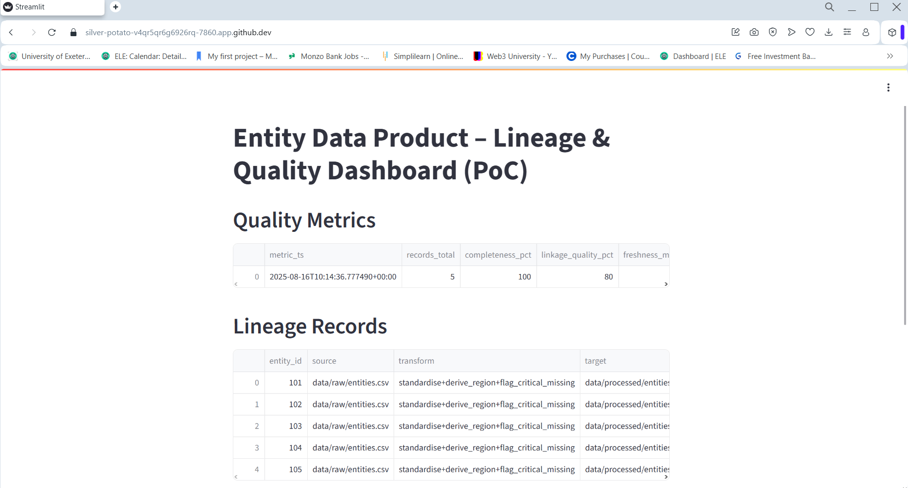
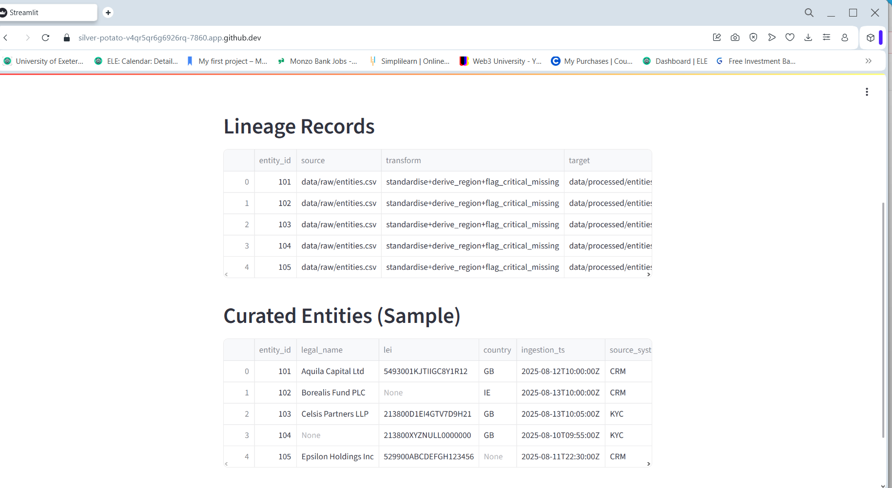
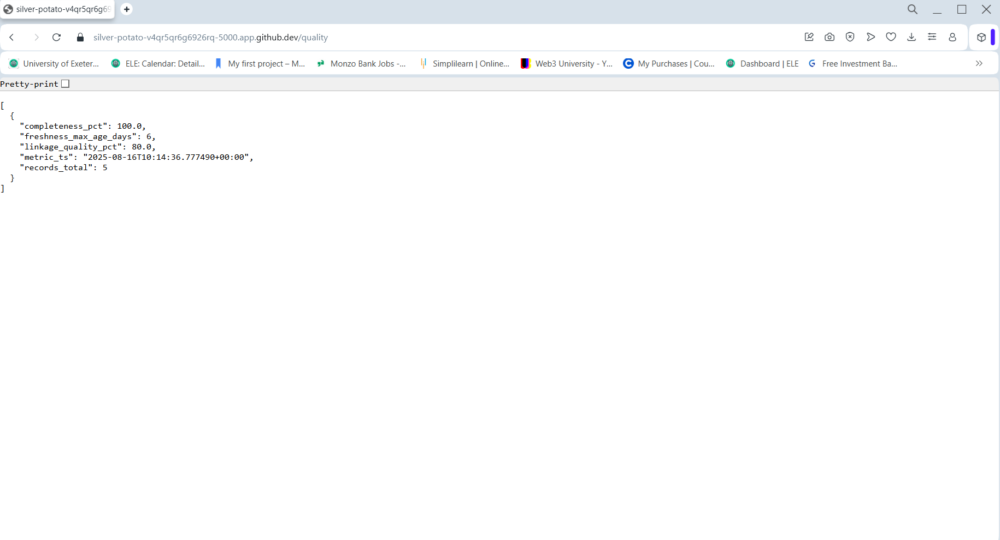

# Entity Data Product – Data Lineage & Quality Dashboard (PoC)

A proof-of-concept demonstrating **data lineage**, **data quality metrics**, and **metadata governance** for an Entity Data Product in a financial services context.
This project simulates a cloud setup (AWS S3 → Databricks → Snowflake) and exposes lineage metadata via a simple API, with a lightweight dashboard for stakeholders.

---

## ✨ What this shows
- **Data lineage mapping**: from raw ingestion to transformed outputs.
- **Data quality KPIs**: completeness, freshness, and linkage quality.
- **Metadata management**: source system, steward, ingestion timestamp.
- **Cloud pattern (simulated)**: S3-like storage (`data/raw`), Databricks-like transforms (`scripts/etl_transform.py`), Snowflake-like warehouse tables (`data/processed`).

> Note: You can replace the simulated pieces with your actual AWS/Snowflake/Databricks connections later.

---

## 🧱 Architecture (PoC)
```
CSV (data/raw) ──> ETL (scripts/etl_transform.py) ──> Curated (data/processed)
             └─> Quality (scripts/compute_quality.py) ──> KPIs (data/processed/quality_metrics.csv)
API (api/app.py) exposes lineage + quality → Dashboard (dashboard/streamlit_app.py)
```

---

## 📂 Folder structure
```
entity-data-product-poc/
├─ data/
│  ├─ raw/                # landing zone (simulated S3)
│  ├─ processed/          # curated zone (simulated Snowflake tables)
│  └─ reference/          # lookup tables, stewards, systems
├─ scripts/
│  ├─ etl_transform.py    # transforms raw to curated + writes lineage
│  └─ compute_quality.py  # computes completeness/freshness/linkage KPIs
├─ api/
│  └─ app.py              # Flask API exposing lineage & quality
├─ dashboard/
│  └─ streamlit_app.py    # lightweight dashboard
├─ requirements.txt
└─ README.md
```

---

## ⚙️ Setup
```bash
python -m venv .venv
source .venv/bin/activate   # Windows: .venv\Scripts\activate
pip install -r requirements.txt
```

### Run ETL and Quality
```bash
python scripts/etl_transform.py
python scripts/compute_quality.py
```

### Start API
```bash
python api/app.py
# -> http://127.0.0.1:5000/lineage
# -> http://127.0.0.1:5000/quality
```

### Start Dashboard
```bash
streamlit run dashboard/streamlit_app.py
```

---

## 🔢 Data quality KPIs (example)
- **Completeness**: % non-null critical fields (e.g., `entity_id`, `legal_name`).
- **Freshness**: max ingestion age (days) based on `ingestion_ts`.
- **Linkage quality**: % of records successfully mapped to a reference system (`lei` present).

---

## 🔐 Governance metadata (DCAM-aligned fields, simplified)
- `source_system`, `data_steward`, `ingestion_ts`, `pii_flag`

---

## 🔌 Swap-in Cloud
Later, replace stubs:
- S3 → `data/raw` (use boto3)
- Databricks → `scripts/etl_transform.py` (use Spark)
- Snowflake → `data/processed` (use Snowflake connector)

---

## Screens

<p align="center">
  
</p>

### Detail Views
<p align="center">
  
</p>
<p align="center">
  
</p>
```

